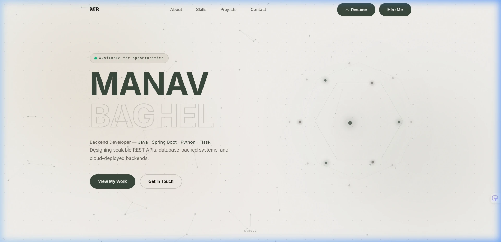
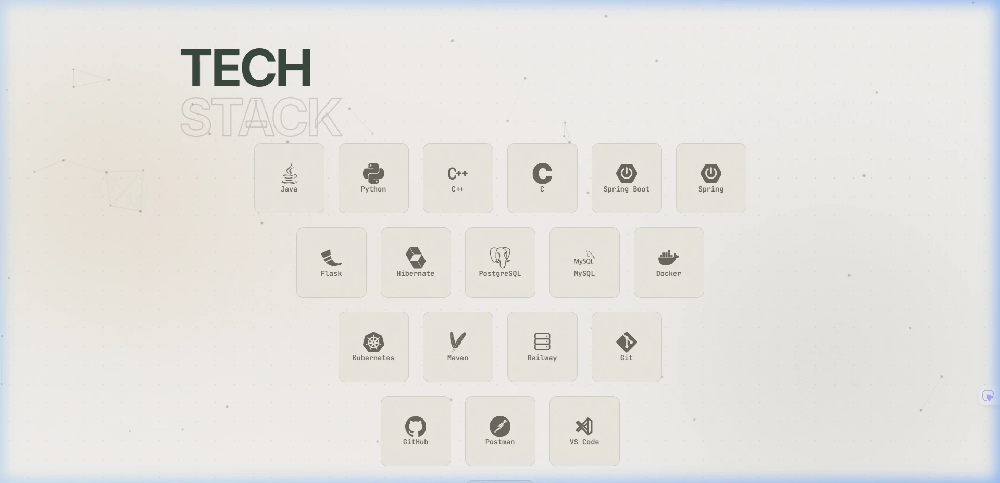
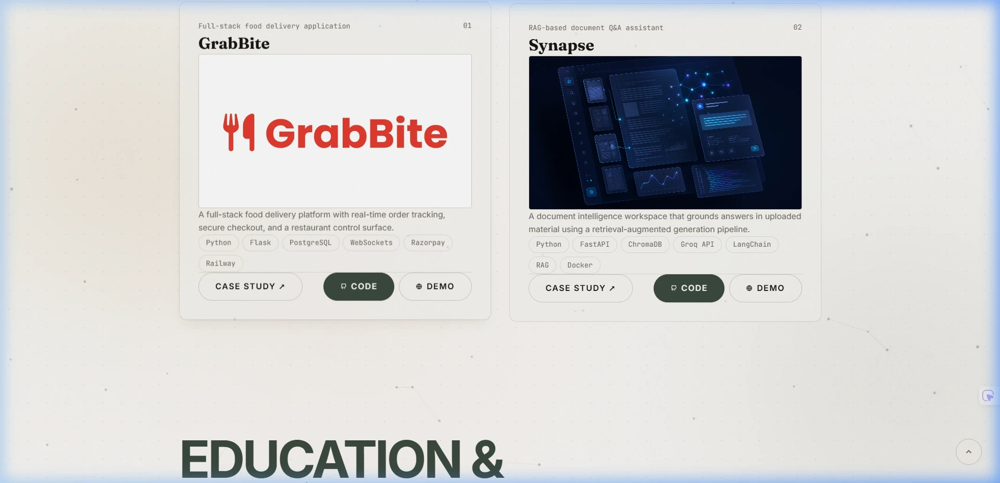

# 🚀 Manav Raj Baghel — Developer Portfolio

> **Backend Developer • Java • Spring Boot • Python**

A modern, recruiter-friendly portfolio built with **React, Vite, Three.js, Framer Motion, and Tailwind CSS**, showcasing my projects, technical skills, internship experience, and software engineering journey.

> **Replace the placeholders below before publishing**
>
> - `YOUR_VERCEL_URL`
> - `YOUR_GITHUB_USERNAME`
> - `YOUR_LINKEDIN_URL`
> - `YOUR_EMAIL`
> - Screenshot paths in `docs/screenshots/`

---

<p align="center">
  
</p>

<p align="center">


</p>

## 🌐 Live Demo

**Website:** YOUR_VERCEL_URL

---

# Table of Contents

- Overview
- Features
- Screenshots
- Tech Stack
- Project Architecture
- Folder Structure
- Getting Started
- Available Scripts
- Performance
- Accessibility
- Design Philosophy
- Roadmap
- Deployment
- Contributing
- License
- Author

---

# 📖 Overview

This portfolio represents my software engineering approach: clean architecture, modern frontend engineering, thoughtful user experience, and attention to performance.

Rather than acting as a simple personal website, it demonstrates my ability to build polished, production-quality interfaces while presenting backend-focused projects in a clear and recruiter-friendly manner.

The portfolio highlights my technical skills, internship experience, certifications, and selected projects while maintaining a premium user experience through smooth animations, responsive layouts, and interactive 3D elements.

---

# ✨ Features

- Premium dark UI
- Interactive Three.js hero
- Smooth Framer Motion animations
- Responsive design
- Backend-focused branding
- Recruiter-friendly layout
- Internship timeline
- Certifications section
- Technical skills grouped by category
- Project architecture diagrams
- Accessibility improvements
- Lazy-loaded components
- Performance optimizations
- SEO-ready metadata
- GitHub & LinkedIn integration

---

# 📸 Screenshots

Create the following structure:

```text
docs/
└── screenshots/
    ├── hero.webp
    ├── about.webp
    ├── skills.webp
    ├── projects.webp
    ├── experience.webp
    └── contact.webp
```

Then embed them:

```md
## Hero



## Skills



## Projects


```

---

# 🛠 Tech Stack

## Frontend

- React
- Vite
- JavaScript (ES6+)
- HTML5
- CSS3
- Tailwind CSS

## UI & Animation

- Three.js
- React Three Fiber
- Framer Motion
- GSAP
- Lucide React

## Development Tools

- Git
- GitHub
- VS Code
- npm

## Deployment

- Vercel

---

# 🏗 Project Architecture

```text
User
   │
   ▼
React + Vite
   │
   ▼
Reusable Components
   │
   ├── Hero
   ├── About
   ├── Skills
   ├── Projects
   ├── Experience
   └── Contact
   │
   ▼
Three.js Scene
   │
   ▼
Framer Motion Animations
```

---

# 📂 Folder Structure

```text
portfolio/
├── public/
├── src/
│   ├── assets/
│   ├── components/
│   ├── sections/
│   ├── hooks/
│   ├── utils/
│   ├── styles/
│   └── App.jsx
├── docs/
├── README.md
├── package.json
└── vite.config.js
```

---

# 🚀 Getting Started

Clone the repository

```bash
git clone https://github.com/YOUR_GITHUB_USERNAME/portfolio.git
```

Install dependencies

```bash
npm install
```

Run locally

```bash
npm run dev
```

Build

```bash
npm run build
```

Preview production build

```bash
npm run preview
```

---

# 📜 Available Scripts

| Command           | Description               |
| ----------------- | ------------------------- |
| `npm run dev`     | Starts development server |
| `npm run build`   | Creates production build  |
| `npm run preview` | Preview production build  |
| `npm run lint`    | Run ESLint                |

---

# ⚡ Performance

This portfolio focuses on performance through:

- Lazy loading
- Code splitting
- Optimized assets
- Responsive rendering
- GPU-friendly animations
- Component-based architecture

---

# ♿ Accessibility

- Semantic HTML
- Keyboard navigation
- Focus indicators
- Reduced motion support
- Responsive typography

---

# 🎨 Design Philosophy

Inspired by modern product companies such as **Linear, Vercel, Stripe, Framer, and Apple**, the portfolio balances visual polish with usability.

Every animation is designed to support the user experience rather than distract from it. The interface emphasizes readability, performance, and recruiter-friendly navigation.

---

# 🗺 Roadmap

- [x] Premium UI
- [x] Interactive 3D hero
- [x] Responsive design
- [x] Recruiter-friendly layout
- [x] Project architecture diagrams
- [ ] Resume integration
- [ ] Technical blog
- [ ] Additional backend projects
- [ ] Project case studies

---

# 🚀 Deployment

This project is deployed on **Vercel**.

Every push to the `main` branch automatically triggers a new production deployment.

---

# 🤝 Contributing

Although this is a personal portfolio, feedback, suggestions, and improvements are always welcome.

Feel free to open an issue or submit a pull request.

---

# 📄 License

This project is licensed under the **MIT License**.

---

# 👨‍💻 Author

**Manav Raj Baghel**

Backend Developer

- GitHub: https://github.com/YOUR_GITHUB_USERNAME
- LinkedIn: YOUR_LINKEDIN_URL
- Portfolio: YOUR_VERCEL_URL
- Email: YOUR_EMAIL

---

# 🙏 Acknowledgements

Design inspiration:

- Vercel
- Linear
- Framer
- Three.js Community
- React Community

---

<p align="center">

### Thank you for visiting!

If you found this project helpful or inspiring, consider giving it a ⭐ on GitHub.

</p>
