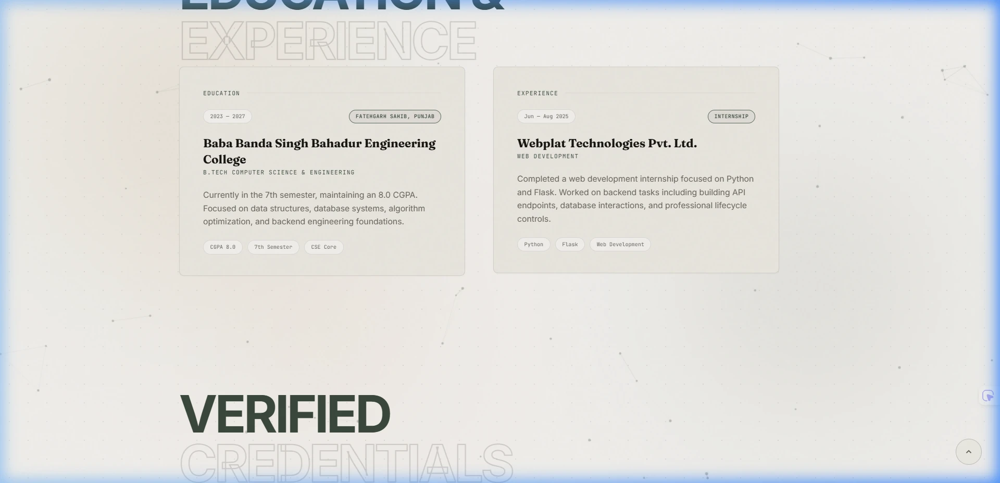
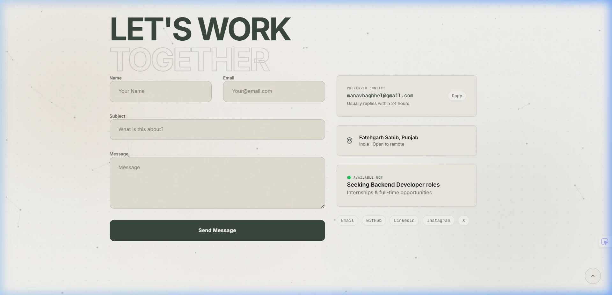
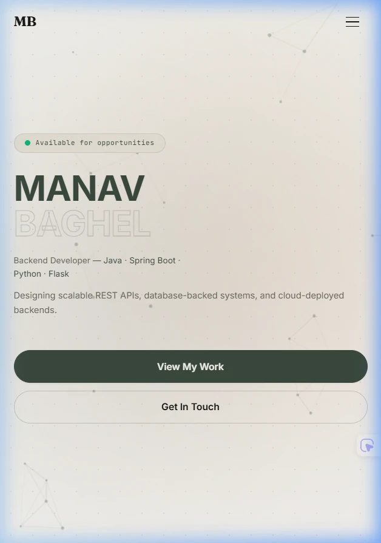

<div align="center">


# Manav Baghel | Developer Portfolio

**Backend Developer** &nbsp;·&nbsp; Java &nbsp;·&nbsp; Spring Boot &nbsp;·&nbsp; Python &nbsp;·&nbsp; Flask

A developer portfolio combining a real-time 3D hero scene, glassmorphic UI, and scroll-driven motion — built with React, Vite, and Three.js, engineered for speed as much as polish.

[**Live Demo**](https://your-portfolio.vercel.app) · [GitHub Repository](https://github.com/manav-2812/portfolio) · [Report an Issue](https://github.com/manav-2812/portfolio/issues) · [Connect on LinkedIn](https://linkedin.com/in/manav-baghel)

<br />


</div>

<br />

## Table of Contents

- [Overview](#overview)
- [Screenshots](#screenshots)
- [Features](#features)
- [Tech Stack](#tech-stack)
- [Project Highlights](#project-highlights)
- [Architecture](#architecture)
- [Folder Structure](#folder-structure)
- [Getting Started](#getting-started)
- [Available Scripts](#available-scripts)
- [Performance](#performance)
- [Accessibility](#accessibility)
- [Responsive Design](#responsive-design)
- [Design Philosophy](#design-philosophy)
- [Roadmap](#roadmap)
- [Why This Portfolio](#why-this-portfolio)
- [Deployment](#deployment)
- [Contributing](#contributing)
- [License](#license)
- [Author](#author)
- [Acknowledgements](#acknowledgements)

<br />

## Overview

This repository contains the source for a personal developer portfolio, built to present projects, technical skills, and experience to recruiters and engineering teams in a format that reflects real front-end engineering ability, not just design taste. The interface pairs a custom Three.js hero scene with a glassmorphic design system, scroll-triggered motion built on Framer Motion, and a component architecture organized around clear separation of concerns — one file per section, shared primitives (buttons, error boundaries) extracted where reused.

The project is intentionally scoped as a single-page application. There is no CMS, no blog engine, and no unnecessary abstraction layer — the goal is a fast, maintainable, content-accurate site that stays easy to update as new projects and experience are added.

<br />

## Screenshots

<div align="center">

<sub>Click any image to view full resolution</sub>

| Hero                                                                      | About & Skills                                                                  |
| ------------------------------------------------------------------------- | ------------------------------------------------------------------------------- |
| [](docs/screenshots/hero.webp) | [](docs/screenshots/skills.webp) |

| Projects                                                                              | Experience                                                                                   |
| ------------------------------------------------------------------------------------- | -------------------------------------------------------------------------------------------- |
| [](docs/screenshots/projects.webp) | [](docs/screenshots/experience.webp) |

| Contact                                                                            | Mobile View                                                                  |
| ---------------------------------------------------------------------------------- | ---------------------------------------------------------------------------- |
| [](docs/screenshots/contact.webp) | [](docs/screenshots/mobile.webp) |

</div>

<br />

## Features

### User Experience

- Interactive 3D hero scene built with React Three Fiber — mouse-reactive icosahedron, orbital rings, and a layered particle field
- Smooth, physics-based page scrolling via Lenis
- Active-section highlighting in the navigation bar using `IntersectionObserver`, with a scroll-progress indicator
- Custom cursor with hover-aware states, automatically disabled on touch devices
- Collapsible, categorized technical skills panel with icon-based skill tiles

### Performance

- Route-level code splitting: the Three.js scene is lazy-loaded via `React.lazy` and `Suspense`, keeping it out of the initial bundle
- Manual chunk splitting in the Vite build configuration, isolating `three` / `@react-three` and `framer-motion` into dedicated vendor chunks for better browser caching
- Device-aware 3D rendering — particle counts, geometry detail, and material sample counts scale down automatically on mobile devices to protect frame rate
- `ErrorBoundary` wraps the 3D scene so a WebGL failure degrades gracefully instead of breaking the page

### Accessibility

- `prefers-reduced-motion` respected in the loading sequence and core animations
- Visible `:focus-visible` states throughout for keyboard navigation
- Semantic landmark structure (`<nav>`, `<section>`, `<footer>`) with ARIA labelling on interactive and list-like regions

### Design

- A single, reusable glassmorphism recipe (blur, layered inset highlights, soft ambient shadow) applied consistently across cards, panels, and the navigation bar
- A restrained two-accent color system (violet and cyan) with technology icons retaining their real brand colors
- Consistent typography scale pairing a bold display font for headings with a monospace face for metadata and labels

### Developer Experience

- Linted with `oxlint`, configured with `react/rules-of-hooks` enforced as an error
- Environment-based configuration for third-party integrations (contact form submission key), kept out of version control
- Component-per-file structure with a shared `MagneticButton` primitive for interactive call-to-action elements

<br />

## Tech Stack

| Category             | Technologies                                   |
| -------------------- | ---------------------------------------------- |
| **Core**             | React 19, Vite 8                               |
| **3D / WebGL**       | Three.js, React Three Fiber, @react-three/drei |
| **Animation**        | Framer Motion, Lenis (smooth scroll)           |
| **Styling**          | Tailwind CSS 4 (via `@tailwindcss/vite`)       |
| **Icons**            | react-icons                                    |
| **Backend Services** | Web3Forms (serverless form submission)         |
| **Tooling**          | oxlint, Vite build with manual chunk splitting |
| **Deployment**       | Vercel                                         |

<br />

## Project Highlights

- ✔ Interactive Three.js hero scene
- ✔ Glassmorphism design system
- ✔ Lazy-loaded WebGL rendering
- ✔ Mobile-optimized 3D performance
- ✔ SEO optimized (meta tags, Open Graph, JSON-LD, sitemap)
- ✔ Accessibility-focused (reduced motion, focus states, semantic structure)
- ✔ Recruiter friendly

<br />

## Architecture

The application is a single-page React app composed of independently scoped section components, mounted in sequence inside `App.jsx`. Smooth scrolling and section transitions are handled at the app level; each section manages its own scroll-triggered animation state independently via Framer Motion's `useInView`.

```
Browser
   │
   ▼
main.jsx → App.jsx
   │
   ├── Lenis (smooth scroll controller)
   ├── Loader (initial load sequence)
   ├── Cursor (custom pointer, desktop only)
   ├── Navbar (scrollspy + scroll-progress)
   │
   ├── Hero
   │     └── ErrorBoundary → Suspense → Scene3D (lazy-loaded, React Three Fiber)
   ├── About → Skills
   ├── Projects
   ├── Experience
   ├── Certifications
   ├── Contact → Web3Forms API
   │
   └── Footer
```

The 3D scene is isolated behind a lazy import and an error boundary specifically so a WebGL initialization failure — an older GPU, disabled hardware acceleration, a locked-down corporate machine — cannot take down the rest of the page.

<br />

## Folder Structure

```
portfolio/
├── docs/
│   ├── banner.webp            # README hero banner
│   └── screenshots/           # Section screenshots referenced in README
├── public/
│   ├── project-previews/     # Project screenshot assets
│   ├── favicon.svg
│   ├── icons.svg
│   ├── robots.txt
│   └── sitemap.xml
├── src/
│   ├── assets/
│   ├── components/
│   │   ├── Scene3D.jsx        # Three.js hero scene
│   │   ├── ErrorBoundary.jsx  # WebGL failure fallback
│   │   ├── Hero.jsx
│   │   ├── Navbar.jsx         # Scrollspy + scroll-progress bar
│   │   ├── About.jsx
│   │   ├── Skills.jsx         # Technical skills panel
│   │   ├── Projects.jsx
│   │   ├── Experience.jsx
│   │   ├── Certifications.jsx
│   │   ├── Contact.jsx        # Web3Forms integration
│   │   ├── MagneticButton.jsx # Shared interactive button primitive
│   │   ├── Cursor.jsx
│   │   └── Loader.jsx
│   ├── App.jsx                # Section composition, Lenis setup
│   ├── main.jsx                # React entry point
│   └── index.css              # Design tokens, glass recipe, global styles
├── index.html                 # Meta tags, Open Graph, JSON-LD
├── vite.config.js             # Manual chunk splitting configuration
└── package.json
└── package.json
```

<br />

## Getting Started

### Prerequisites

- Node.js 18 or later
- npm

### Installation

```bash
# Clone the repository
git clone https://github.com/manav-2812/portfolio.git
cd portfolio

# Install dependencies
npm install
```

### Environment Variables

The contact form submits through [Web3Forms](https://web3forms.com). Create a `.env` file in the project root:

```bash
VITE_WEB3FORMS_KEY=your-access-key-here
```

### Run locally

```bash
npm run dev
```

<br />

## Available Scripts

| Command           | Description                                                |
| ----------------- | ---------------------------------------------------------- |
| `npm run dev`     | Starts the Vite development server with hot module reload  |
| `npm run build`   | Produces an optimized production build in `dist/`          |
| `npm run preview` | Serves the production build locally for final verification |
| `npm run lint`    | Runs `oxlint` against the codebase                         |

<br />

## Performance

The 3D scene is the single heaviest part of this application, so it is treated accordingly:

- Loaded via `React.lazy` + `Suspense`, so it never blocks first paint or delays the rest of the page from becoming interactive
- Wrapped in an `ErrorBoundary`, so a WebGL failure fails gracefully instead of breaking the page
- Particle counts, geometry segment detail, and material sample/resolution values are all reduced on mobile viewports rather than assuming desktop-tier GPU performance everywhere
- `three` and `@react-three/*` are isolated into a dedicated `three-vendor` chunk, and `framer-motion` into an `animation-vendor` chunk, via manual chunk configuration in `vite.config.js` — this keeps vendor code cacheable independently of application code changes

<br />

## Accessibility

- `prefers-reduced-motion` is checked and respected in the loading sequence and primary animation paths
- All interactive elements expose visible `:focus-visible` outlines for keyboard users
- Sections use semantic landmarks (`<nav>`, `<section>`, `<footer>`), and grouped/interactive content (skill lists, navigation) carries appropriate ARIA roles and labels

<br />

## Responsive Design

The layout is built with a fluid, `clamp()`-based type scale and Tailwind's responsive breakpoints throughout, tested across common desktop, laptop, tablet, and mobile viewport widths. The 3D scene and custom cursor are specifically adapted for smaller viewports — the cursor is disabled on touch devices, and 3D rendering complexity scales down below the tablet breakpoint.

<br />

## Design Philosophy

The interface is built around a small number of consistent primitives — one glassmorphism recipe, one accent color pair, one type scale — reused everywhere rather than styled per section. The intent is a site that reads as designed by a single hand rather than assembled from disconnected passes: motion is used to support hierarchy and feedback (scroll reveals, hover states, focus states), not as decoration for its own sake, and every visual decision is weighed against its cost to load time and frame rate before being kept.

<br />

## Roadmap

- [ ] Expand the Projects section with additional case studies
- [ ] Add a downloadable resume with tracked engagement
- [ ] Introduce automated Lighthouse CI checks on deploy
- [ ] Add unit test coverage for form submission logic
- [ ] Add a `docs/` folder with a full visual changelog of design iterations

<br />

## Why This Portfolio

This project exists to demonstrate software engineering ability through the artifact itself, not only through the projects it links to. Every architectural decision — lazy-loading the 3D scene, isolating vendor chunks, wrapping WebGL in an error boundary, keeping the design system to a small set of reused primitives — is chosen the same way it would be on a production codebase: for maintainability and reliability first, with visual polish built on top of that foundation rather than in place of it.

<br />

## Deployment

|               |        |
| ------------- | ------ |
| **Framework** | Vite   |
| **Hosting**   | Vercel |

The production build is deployed on [Vercel](https://vercel.com), which auto-detects the Vite framework preset from `package.json`. Pushes to the `main` branch trigger an automatic build and deploy. The `VITE_WEB3FORMS_KEY` environment variable must be configured in the Vercel project settings, since it is intentionally excluded from version control.

<br />

## Contributing

This is a personal portfolio rather than an open-source library, so pull requests aren't the expected workflow — but feedback, bug reports, and suggestions are genuinely welcome. Feel free to open an [issue](https://github.com/manav-2812/portfolio/issues) if something looks broken or could be improved.

<br />

## License

Distributed under the MIT License. See [`LICENSE`](./LICENSE) for details.

<br />

## Author

**Manav Baghel**
Backend Developer · B.Tech CSE

- GitHub: [@manav-2812](https://github.com/manav-2812)
- LinkedIn: [linkedin.com/in/manav-baghel](https://linkedin.com/in/manav-baghel)
- Portfolio: [your-portfolio.vercel.app](https://your-portfolio.vercel.app)
- Email: [manavbaghhel@gmail.com](mailto:manavbaghhel@gmail.com)

<br />

## Acknowledgements

Design direction informed by the marketing sites of [Vercel](https://vercel.com), [Linear](https://linear.app), and [Framer](https://framer.com), and by the broader [React Three Fiber](https://docs.pmnd.rs/react-three-fiber) community documentation and examples.

<br />

<div align="center">

If this project was interesting or useful, consider leaving a ⭐

</div>
