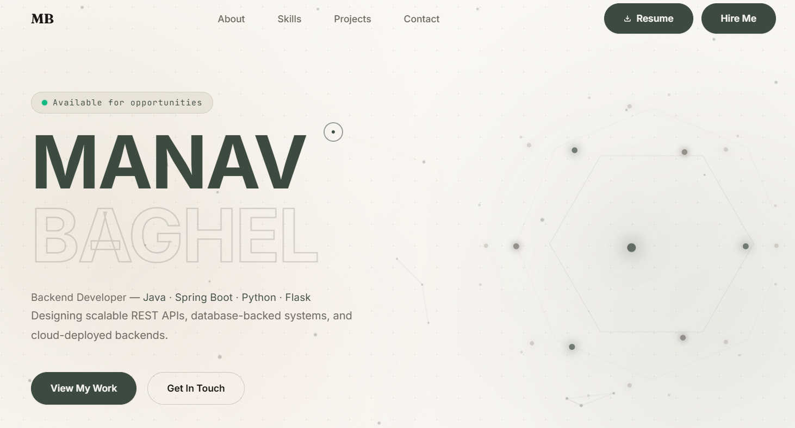
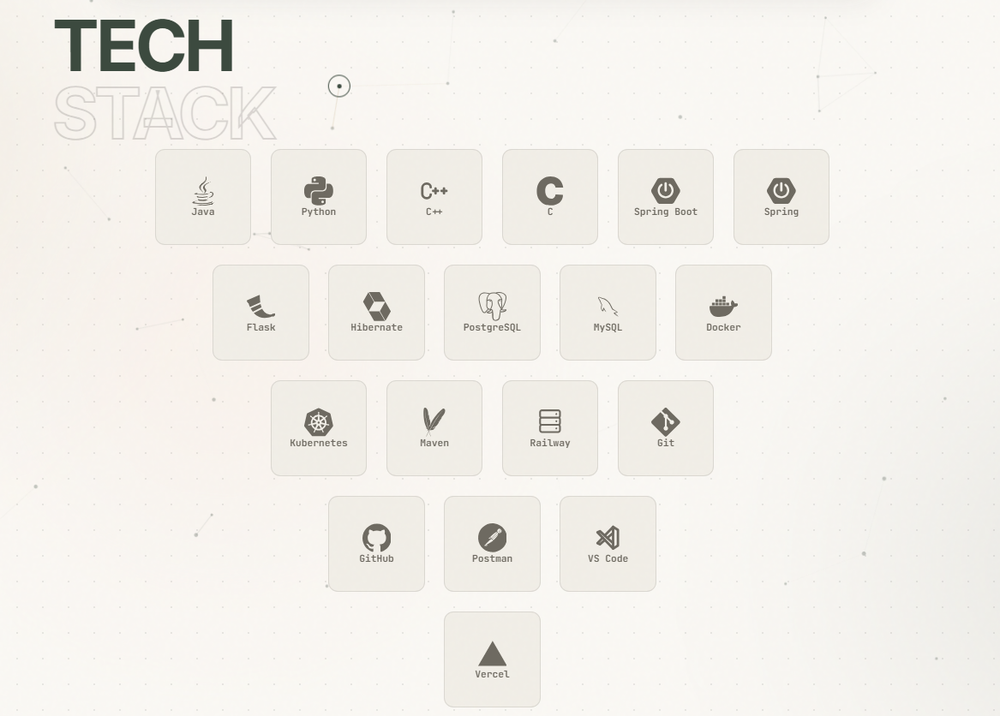
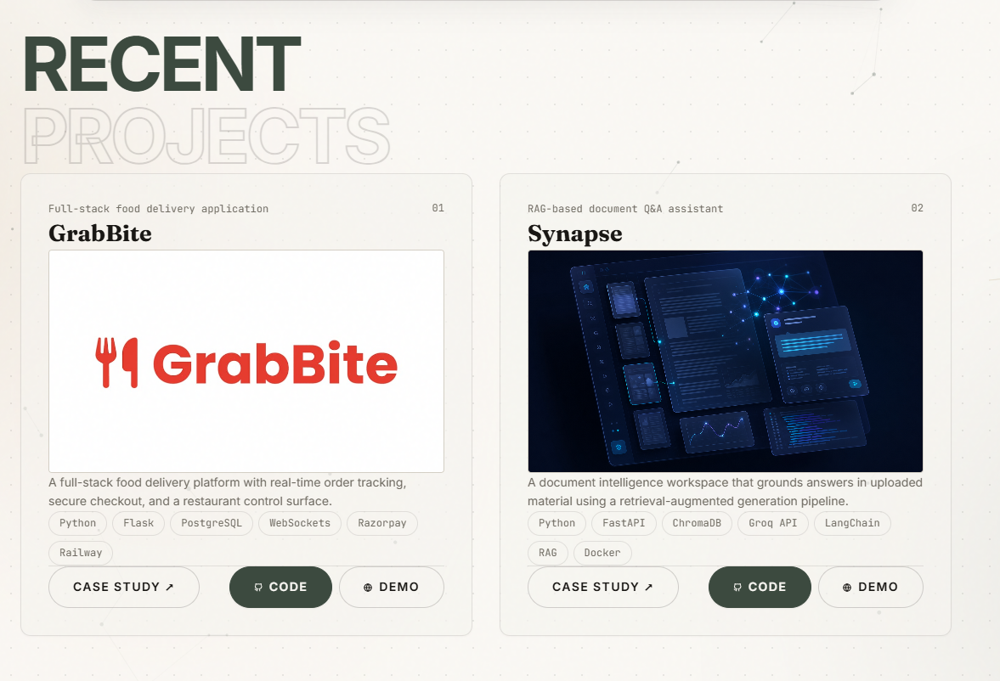
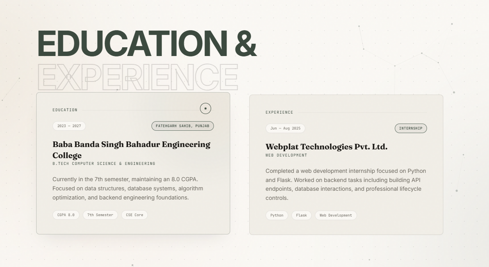
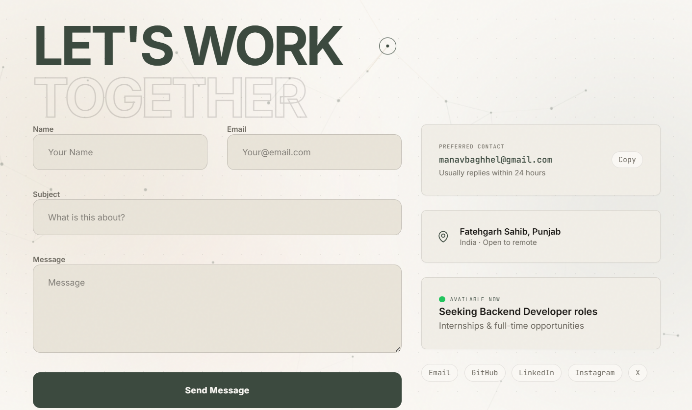
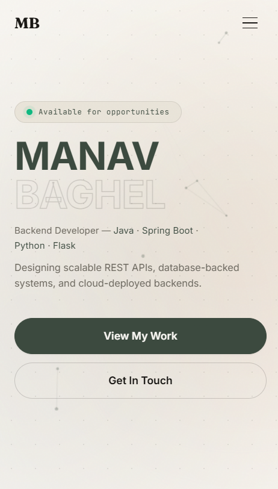

<div align="center">

# Manav Baghel | Developer Portfolio

**Backend Developer** &nbsp;·&nbsp; Java &nbsp;·&nbsp; Spring Boot &nbsp;·&nbsp; Python &nbsp;·&nbsp; Flask

A developer portfolio featuring an editorial design system, scroll-driven motion, custom cursor physics, and clean layout composition — built with React, Vite, and Tailwind CSS, engineered for speed and clarity.

[**Live Demo**](https://manavbaghel.vercel.app) · [GitHub Repository](https://github.com/manav-2812/portfolio) · [Report an Issue](https://github.com/manav-2812/portfolio/issues) · [Connect on LinkedIn](https://linkedin.com/in/manav-baghel)

<br />


[](#)

</div>

<br />

## Table of Contents

- [Overview](#overview)
- [Screenshots](#screenshots)
- [Features](#features)
- [Tech Stack](#tech-stack)
- [Project Highlights](#project-highlights)
- [Architecture](#architecture)
- [Folder Structure](#folder-structure)
- [Getting Started](#getting-started)
- [Available Scripts](#available-scripts)
- [Performance](#performance)
- [Accessibility](#accessibility)
- [Responsive Design](#responsive-design)
- [Design Philosophy](#design-philosophy)
- [Roadmap](#roadmap)
- [Why This Portfolio](#why-this-portfolio)
- [Deployment](#deployment)
- [Contributing](#contributing)
- [License](#license)
- [Author](#author)
- [Acknowledgements](#acknowledgements)

<br />

## Overview

This repository contains the source for a personal developer portfolio, built to present projects, technical skills, and experience to recruiters and engineering teams in a format that reflects real engineering ability. The interface pairs a refined typographic layout with a clean design system, scroll-triggered motion built on Framer Motion, custom cursor tracking, and a component architecture organized around clear separation of concerns — with modular sections and shared primitives (like custom physics-based buttons) extracted for reusability.

The project is intentionally scoped as a single-page application. There is no CMS, no blog engine, and no unnecessary abstraction layer — the goal is a fast, maintainable, content-accurate site that stays easy to update as new projects and experience are added.

<br />

## Screenshots

<div align="center">

<sub>Click any image to view full resolution</sub>

| Hero                                                                      | About & Skills                                                                  |
| ------------------------------------------------------------------------- | ------------------------------------------------------------------------------- |
| [](docs/screenshots/hero.png)   | [](docs/screenshots/skills.png)   |

| Projects                                                                              | Experience                                                                                   |
| ------------------------------------------------------------------------------------- | -------------------------------------------------------------------------------------------- |
| [](docs/screenshots/projects.png)   | [](docs/screenshots/experience.png)   |

| Contact                                                                            | Mobile View                                                                  |
| ---------------------------------------------------------------------------------- | ---------------------------------------------------------------------------- |
| [](docs/screenshots/contact.png)   | [](docs/screenshots/mobile.png)   |

</div>

<br />

## Features

### User Experience

- **Smooth Inertial Scrolling**: Managed globally using Lenis for premium mousewheel scrolling decay.
- **Scrollspy Progress Bar**: Custom horizontal scroll progress bar (`#scroll-progress`) inside `Navbar.jsx` tracking page scroll percentage.
- **Intersection-Spy Navbar**: Tracks and highlights the current section in view using a decoupled IntersectionObserver instance.
- **Custom Tracking Cursor**: Physics-based cursor ring utilizing linear interpolation (lerp: `0.15`) that morphs size on hover states, optimized with document-level event delegation (disabled on touch devices).
- **Touch-safe Hover Safeguards**: Uses a device pointer capability check to disable hover effects (`whileHover` scaling, colors) on touch devices, completely avoiding "stuck hover" states.
- **Collapsible, Categorized Skills**: Technical skills panel grouped by domain (languages, databases, backend, DevOps, tools) with smooth reveal states.

### Performance

- **Route-level Code Splitting**: Heavy viewports (Projects, Experience, and Certifications) are lazy-loaded via `React.lazy` and `Suspense` to preserve initial load speeds.
- **Manual Chunk Splitting**: isolates Framer Motion and core vendor dependencies into dedicated vendor chunks in the Vite build config, optimizing long-term client-side caching.
- **Render-Decoupled Coordinate Loops**: Pointer coordinates for custom cursor tracking are stored in references (`useRef`) and updated directly on the DOM inside a `requestAnimationFrame` loop, resulting in 0 React state re-renders during tracking.
- **Viewport-Gated Orbit Animations**: Conditionally unmounts the 26-dot orbiting constellation on viewports below 1024px, completely eliminating CPU/battery cycles from running hidden background animations on mobile.
- **Passive Event Observers**: Global window scroll and resize event observers are bound with passive flags to prevent main-thread layout blocking.

### Accessibility

- **Reduced Motion Support**: Entrance animations, background ambient particles, and page loading progress loops check for system-level configurations (`prefers-reduced-motion: reduce`) and bypass animations dynamically.
- **Visible Keyboard Focus**: Custom focus ring outlines styled via `:focus-visible` to ensure seamless tab progression visibility for keyboard-only users.
- **Semantic Landmark Structures**: Pages utilize correct landmark elements (`<nav>`, `<section>`, `<main>`, `<footer>`) combined with explicit ARIA descriptive tags on interactive sections.

### Design

- **Editorial Typography Scale**: Combines _Fraunces_ (Google Fonts display serif) for display titles, _Inter_ (sans-serif) for body copies, and _JetBrains Mono_ (monospace) for structural status tags.
- **Sub-Pixel Borders**: Leverages thin custom design borders (`var(--hairline)`) and ambient shadows to create card separation without visual clutter.
- **Surfaces & Texture**: CSS Turbulence fractal SVG noise overlay applied dynamically to give layouts a premium tactile paper surface.

### Developer Experience

- **Oxlint Static Code Analysis**: Configured with strict hook rule checks for near-instant compiler analysis.
- **Environment Key Gating**: Local API submit keys gated via environment configs (`.env`) to prevent credentials leakage.
- **Separation of Concerns**: Global compositions kept separated from layout-specific logic inside specialized component folders.

<br />

## Tech Stack

| Category             | Technologies                                          |
| -------------------- | ----------------------------------------------------- |
| **Core**             | React 19, Vite 8, JavaScript (ES Modules)             |
| **Animation**        | Framer Motion 12, Lenis (smooth scroll)               |
| **Styling**          | Vanilla CSS, Tailwind CSS 4 (via `@tailwindcss/vite`) |
| **Icons**            | react-icons (hi2, si, fa6, vsc, tb)                   |
| **Backend Services** | Web3Forms (serverless form submission)                |
| **Tooling**          | oxlint, Vite build with manual chunk splitting        |
| **Deployment**       | Vercel                                                |

<br />

## Project Highlights

- ✔ Premium editorial design system
- ✔ Linear-interpolation Custom Cursor
- ✔ Active horizontal scroll progress tracking bar
- ✔ Lazy-loaded layout splitting
- ✔ Environment key gating (Web3Forms)
- ✔ Accessibility-first styling (Reduced motion / Focus outlines)
- ✔ Recruiter-optimized resume layout

<br />

## Architecture

The application is structured as a client-side Single-Page React App (SPA). Smooth scrolling and viewport scroll heights are calculated globally at the layout level; each section manages its own scroll-triggered entry transition independently via Framer Motion's Intersection Observer triggers (`useInView`).

```
Browser Viewport
   │
   ├── Lenis (Scroll Controller)
   ├── Cursor (Independent Pointer Tracker)
   ├── #scroll-progress (Dynamic horizontal progress tracking bar)
   │
   ▼
App.jsx (Client-Side Router & Layout Shell)
   │
   ├── Loader (Entrance block — locks scroll until 100% complete)
   ├── Navbar (Scrollspy navigation updates)
   │
   ├── main-content (Landmarks)
   │     ├── Hero (Interactive constellation particle canvas)
   │     ├── About (Profile grids)
   │     ├── Projects (Lazy-loaded, Code-split)
   │     ├── Experience (Lazy-loaded, Code-split)
   │     ├── Certifications (Lazy-loaded, Code-split)
   │     └── Contact (Secure Form submission)
   │
   └── Footer (Social references, direct mail links)
```

The Projects, Experience, and Certifications modules are lazy-loaded behind React's dynamic importing system (`React.lazy` + `Suspense`). This ensures the initially loaded script is lightweight, delivering fast performance metrics during the initial paint cycle.

<br />

## Folder Structure

```
portfolio/
├── public/
│   ├── project-previews/     # Project preview screenshots
│   │   ├── grabbite_image.jpg
│   │   └── synapse-workspace.png
│   ├── apple-touch-icon.png  # Apple launcher icon
│   ├── favicon.svg           # Website branding favicon
│   ├── llms.txt              # LLM assistant scraping instructions
│   ├── og-preview.png        # Open Graph preview card image (1200x620px)
│   ├── resume.pdf            # PDF copy of developer resume
│   ├── robots.txt            # Search engine crawl rules
│   └── sitemap.xml           # XML sitemap mapping URLs
├── docs/
│   └── screenshots/          # Portfolio showcase screenshots
│       ├── contact.png
│       ├── experience.png
│       ├── hero.png
│       ├── mobile.png
│       ├── projects.png
│       └── skills.png
├── src/
│   ├── assets/               # Local static assets (empty)
│   ├── components/
│   │   ├── About.jsx          # Biography & focus descriptions
│   │   ├── Certifications.jsx # Certificate showcase visual timeline
│   │   ├── CommandPalette.jsx # Keyboard navigation command palette
│   │   ├── Contact.jsx        # Web3Forms custom mail container
│   │   ├── Cursor.jsx         # Interactive pointer custom cursor
│   │   ├── Experience.jsx     # Chronological work history timeline
│   │   ├── Hero.jsx           # Parallax top viewport with layout
│   │   ├── Loader.jsx         # Custom app entrance progress loader
│   │   ├── MagneticButton.jsx # Spring hover physics wrapper
│   │   ├── Navbar.jsx         # Scrollspy top navigation
│   │   ├── NotFound.jsx       # Custom mouse-grid 404 handler
│   │   ├── PremiumBackground.jsx # Dynamic constellation particle background
│   │   ├── Projects.jsx       # Work projects grid layout
│   │   └── TechStack.jsx      # Skills and technologies board
│   ├── hooks/
│   │   └── useCoarsePointer.js # Device capability detection hook
│   ├── test/                 # Test suite setup and files
│   │   ├── App.property.test.jsx
│   │   ├── Loader.property.test.jsx
│   │   └── setup.js
│   ├── App.jsx                # Layout composition, navigation and Lenis scroll
│   ├── main.jsx               # React core bootstrapper entry
│   └── index.css              # Main tailwind and custom design system rules
├── .gitignore                 # Specifies intentionally untracked files to ignore
├── .oxlintrc.json             # Static code analysis configuration for Oxlint
├── index.html                 # Main document HTML entry shell
├── LICENSE                    # MIT License specification file
├── tailwind.config.js         # Tailwind theme configuration
├── vite.config.js             # Vite configurations and rollup chunk splits
└── package.json               # Package commands and dependencies list
```

<br />

## Getting Started

### Prerequisites

- Node.js 18 or later
- npm

### Installation

```bash
# Clone the repository
git clone https://github.com/manav-2812/portfolio.git
cd portfolio

# Install dependencies
npm install
```

### Environment Variables

The contact form submits through [Web3Forms](https://web3forms.com). Create a `.env` file in the project root:

```bash
VITE_WEB3FORMS_KEY=your-access-key-here
```

### Run locally

```bash
npm run dev
```

<br />

## Available Scripts

| Command              | Description                                                |
| -------------------- | ---------------------------------------------------------- |
| `npm run dev`        | Starts the Vite development server with hot module reload  |
| `npm run build`      | Produces an optimized production build in `dist/`          |
| `npm run preview`    | Serves the production build locally for final verification |
| `npm run lint`       | Runs `oxlint` against the codebase                         |
| `npm run test`       | Runs the test suite via Vitest (single run)                |
| `npm run test:watch` | Runs Vitest in watch mode for active testing development   |

<br />

## Performance

To deliver optimal loading times and keep frames fluid, several front-end performance techniques are used:

- **Modular Code Splitting**: Non-critical sections (`Projects`, `Experience`, `Certifications`) are loaded lazily via `React.lazy` and `Suspense` so they do not block initial painting cycles.
- **Manual Chunk Separation**: Vite's Rollup manual chunk splits compile `framer-motion` into a distinct `animation-vendor` bundle, allowing long-term browser cache retention on client systems.
- **Render-Decoupled Coordinates**: Pointer coordinates for the cursor ring and progress values are stored in references (`useRef`), updating DOM transforms inside a `requestAnimationFrame` loop. This avoids the cost of React state updates and reconciliation.
- **Event Delegation**: The custom cursor listens to cursor moves via a single document-wide mousemove delegator rather than binding listeners on every interactive component.

<br />

## Accessibility

- **Reduced Motion Support**: Enforces system-level accessibility configurations (`prefers-reduced-motion: reduce`) globally across entrance loops, constellation animations, and scroll transitions.
- **Visible Focus States**: Custom `:focus-visible` ring outlines are configured throughout, ensuring keyboard focus is easily identifiable and styled to match.
- **Semantic Hierarchy**: Utilizes proper semantic HTML5 landmarks (`<nav>`, `<section>`, `<main>`, `<footer>`) paired with explicit ARIA roles (`role="list"`, `role="listitem"`, `aria-live`) for screen-readers.

<br />

## Responsive Design

The viewport is tested across standard breakpoints (mobile, tablet, desktop) using mobile-first styles:

- **Mobile (< 768px)**: Adapts vertical whitespace with compact padding values (`6.5rem`), transforms grids to single-column blocks, disables the desktop-specific custom `Cursor`, suppresses hover animations to avoid "stuck tap" styles, and unmounts the orbiting constellation to save mobile CPU/battery.
- **Tablet (768px - 1024px)**: Scales layout elements into grid structures.
- **Desktop (> 1024px)**: Enables custom circular mouse cursors, scroll progress indicators, and multi-column visual boards.

<br />

## Design Philosophy

The design operates on a unified system of custom tokens (CSS variables) to enforce visual consistency across all viewports. It pairs clean typography—_Fraunces_ (display), _Inter_ (body), and _JetBrains Mono_ (labels)—with sub-pixel card details, subtle paper grain, and spring-driven animations. Motion and page transitions are used specifically for visual hierarchy and scroll progress markers rather than decoration.

<br />

## Roadmap

- [ ] Expand the projects catalogue with additional work details
- [ ] Configure automatic Lighthouse auditing within the CI/CD pipeline
- [ ] Integrate full end-to-end integration test suites for contacts forms
- [ ] Refactor icons loading into dynamic, asynchronous SVG symbols

<br />

## Why This Portfolio

This portfolio is structured to demonstrate code quality, accessibility, and architectural discipline. Every engineering decision—from manual Rollup code-splitting and dynamic suspense hooks to performance-optimized cursor refs and strict design systems—is modeled in the same way it would be in a production enterprise environment: emphasizing scalability, cross-browser compatibility, and performance first.

<br />

## Deployment

|               |        |
| ------------- | ------ |
| **Framework** | Vite   |
| **Hosting**   | Vercel |

The production build is deployed on [Vercel](https://vercel.com), which auto-detects the Vite framework preset from `package.json`. Pushes to the `main` branch trigger an automatic build and deploy. The `VITE_WEB3FORMS_KEY` environment variable must be configured in the Vercel project settings, since it is intentionally excluded from version control.

<br />

## Contributing

This is a personal portfolio rather than an open-source library, so pull requests aren't the expected workflow — but feedback, bug reports, and suggestions are genuinely welcome. Feel free to open an [issue](https://github.com/manav-2812/portfolio/issues) if something looks broken or could be improved.

<br />

## License

Distributed under the MIT License. See [`LICENSE`](./LICENSE) for details.

<br />

## Author

**Manav Baghel**
Backend Developer · B.Tech CSE

- GitHub: [@manav-2812](https://github.com/manav-2812)
- LinkedIn: [linkedin.com/in/manav-baghel](https://linkedin.com/in/manav-baghel)
- Portfolio: [manavbaghel.vercel.app](https://manavbaghel.vercel.app)
- Email: [manavbaghhel@gmail.com](mailto:manavbaghhel@gmail.com)

<br />

## Acknowledgements

Design layout concepts are inspired by premium developer platforms such as Vercel, Linear, and Stripe, alongside documentation standards from the React and Vite communities.

<br />

<div align="center">

If this project was interesting or useful, consider leaving a ⭐

</div>
